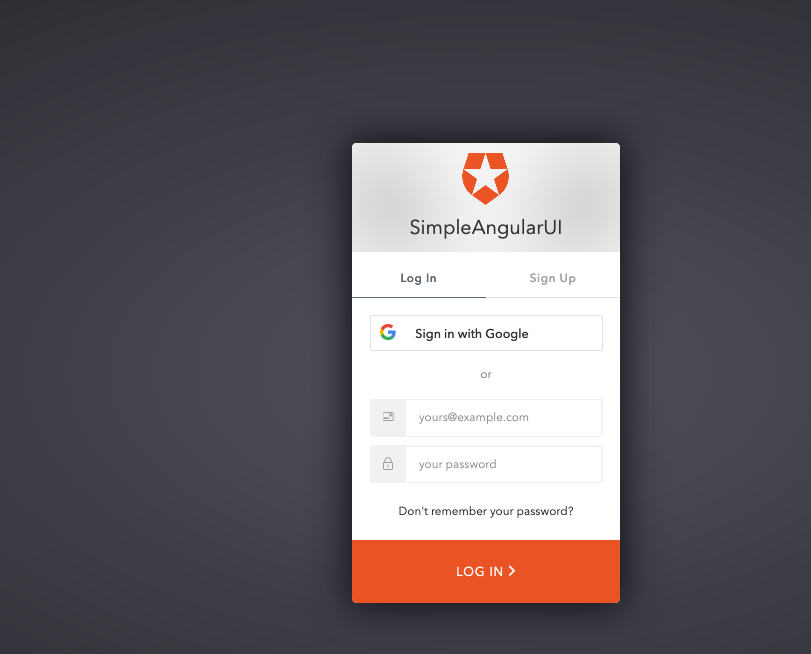
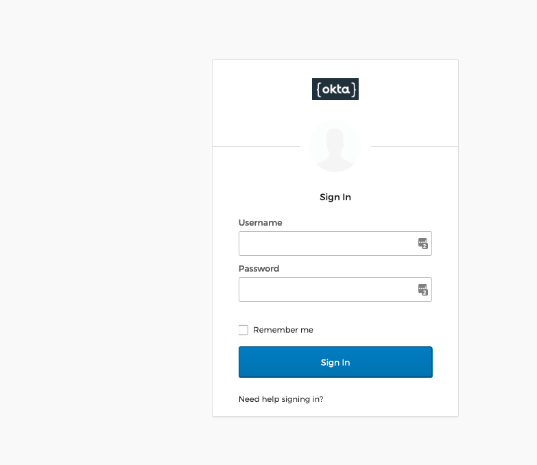
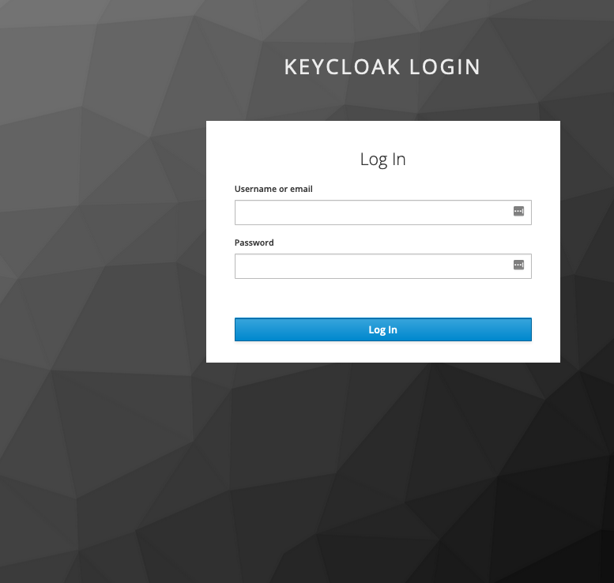

# A Simple Angular UI Using OpenId Implicit Flow 

>A Simple Angular UI that logs in users using OpenId Implicit Flow. This intent of this project is to demonstrate an Angular App using the OpenId Implicit Fow, rather than Angular coding best practices. The SPA can successfully connect to OpenId compliant Identity Providers such as Keycloak, Okta and Auth0. Uses environment.ts to demonstrate switching between KeyCloak, Okta and Auth0 

# Installing and running this project

  
Run the Angular App locally

  
  

  
Angular CLI commands

  
This project was generated with [Angular CLI](https://github.com/angular/angular-cli) version 10.1.3.

## Development server

Run `ng serve` for a dev server. Navigate to `http://localhost:4200/`. The app will automatically reload if you change any of the source files.

## Code scaffolding

Run `ng generate component component-name` to generate a new component. You can also use `ng generate directive|pipe|service|class|guard|interface|enum|module`.

## Build

Run `ng build` to build the project. The build artifacts will be stored in the `dist/` directory. Use the `--prod` flag for a production build.

## Running unit tests

Run `ng test` to execute the unit tests via [Karma](https://karma-runner.github.io).

## Running end-to-end tests

Run `ng e2e` to execute the end-to-end tests via [Protractor](http://www.protractortest.org/).

## Further help

To get more help on the Angular CLI use `ng help` or go check out the [Angular CLI README](https://github.com/angular/angular-cli/blob/master/README.md).

  
Single Sign On With Auth0
  
  <kbd></kbd>

  
Single Sign On With Okta
  
  <kbd></kbd>

  
Single Sign On With KeyCloak
  
  <kbd></kbd>

  
  

