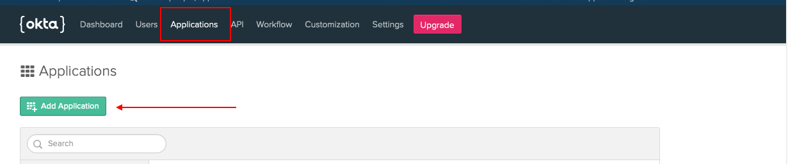
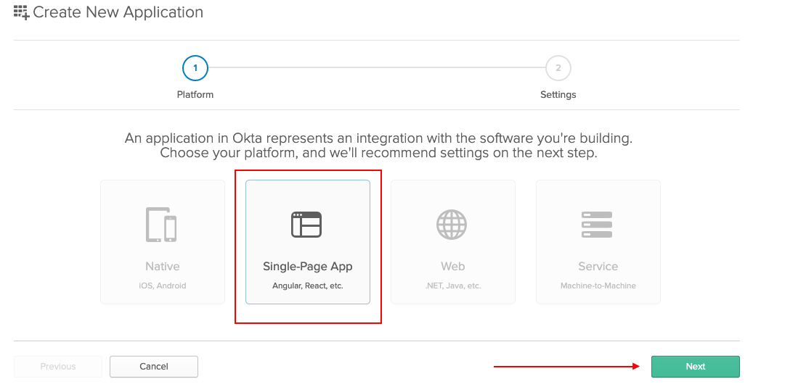
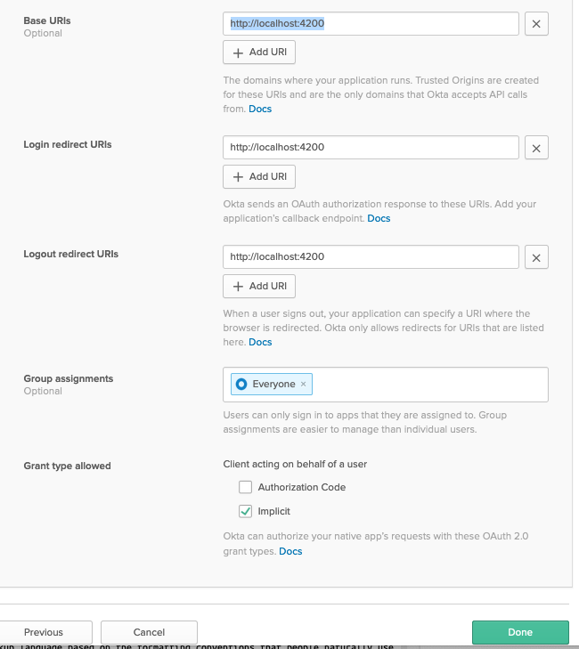
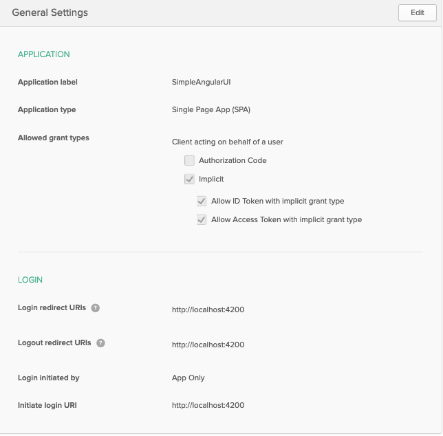
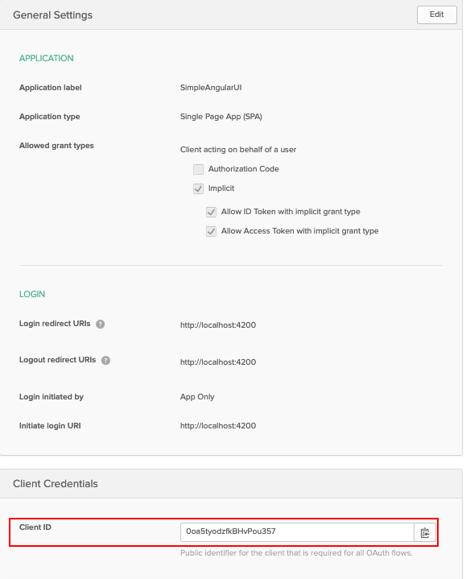
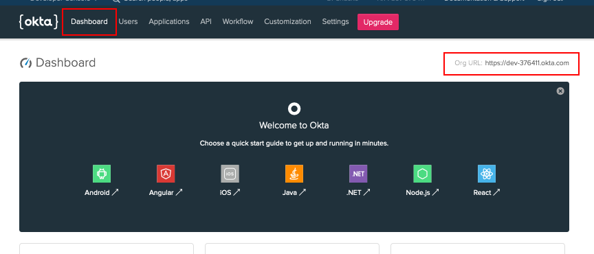

# Register a SPA application with Okta

Step by step instuction on registrering a SPA application in Okta to support OpenId Connection implict login flow

# Create a free Okta development account

Create a free Okta development account at [Okta.com](https://developer.okta.com/signup/). Once this account is created, you can then login to your Okta account [Login to Okta](https://login.okta.com/)

# Register your SPA application

# Choose Single-Page App

# Enter the application details

- Base URIs : http://localhost:4200
- Login redirect URIs : http://localhost:4200
- Logout redirect URIs : http://localhost:4200
- Group Assignments : Everyone
- Grant Type Allowed : Implicit
- Click on the Done Button

Your Registered application should look similar to the screenshot below:

# Make a note of the Client ID

# Make a note of your account's issuer URL

